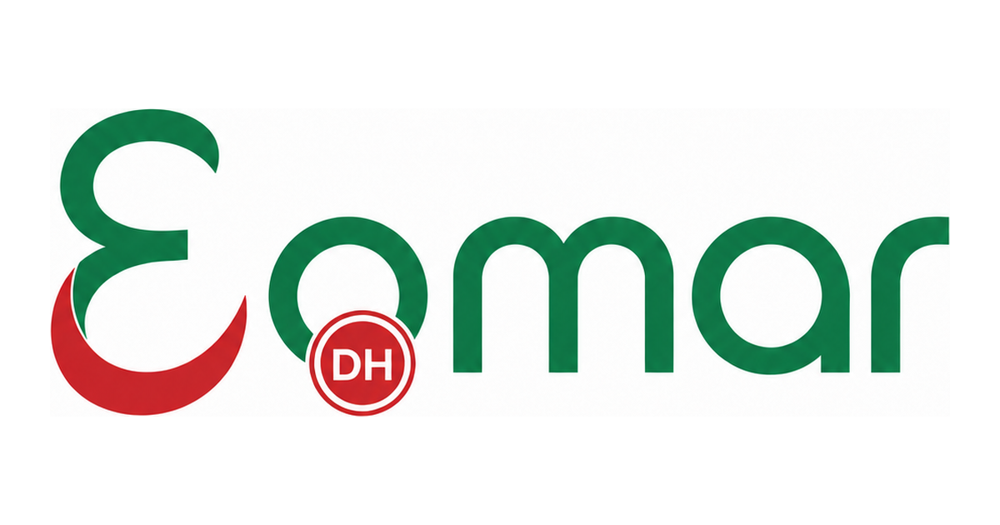

# 3omar · Le bulletin de paie Marocain open source



3omar est un simulateur pédagogique qui aide à comprendre les principaux calculs d'un salaire net au Maroc. Chaque simulation affiche les taux, assiettes et références réglementaires utilisés.

> **Pourquoi « 3omar » ?** En darija marocaine, عمر (Omar) s'écrit « 3omar », le chiffre 3 dessine le ع. Le reste est une histoire entre Marocains ;-) 

> Aucune donnée personnelle n'est stockée. Chaque simulation est calculée à la demande.

## Fonctionnalités

- CNSS, AMO, CIMR et IR progressif.
- Frais professionnels, charges de famille et retraite complémentaire.
- Prime d'ancienneté, heures supplémentaires et indemnités exonérées.
- Salaire net, détail des retenues et coût total employeur.
- Documentation générée depuis `config/payroll.php`, source unique des paramètres.

Tout cela, conforme aux derniers texte légaux et réglementaires qui régissent ces différentes rubriques.

3omar reste une simulation pédagogique. Pour un bulletin de paie officiel ou une situation particulière, consultez votre employeur ou un professionnel.

## Lancer avec Docker

Prérequis : Docker Compose.

```bash
cp .env.example .env
docker compose up -d --build
docker run --rm \
  -v "$PWD":/app \
  -v paie_maroc_vendor:/app/vendor \
  -w /app composer:2.7 composer install
docker compose exec app php artisan key:generate
```

L'application est disponible sur **http://localhost:49173**.

## Développement

```bash
docker compose exec app php artisan optimize:clear
docker compose exec app vendor/bin/pint
docker compose exec app vendor/bin/phpunit
```

Il n'existe pas d'étape de build frontend : Bootstrap, Bootstrap Icons et Chart.js sont chargés par CDN.

## Déploiement

Une image de production (PHP-FPM, Nginx et Supervisor dans un seul
conteneur, build dans `docker/release/Dockerfile`) est publiée sur
GitHub Container Registry à chaque release :

```bash
docker run -d -p 8080:80 \
  -e APP_KEY="$(docker run --rm ghcr.io/zakmaf/3omar:latest php artisan key:generate --show)" \
  ghcr.io/zakmaf/3omar:latest
```

Tags disponibles : `latest`, `v1`, `v1.0`, `v1.0.0` (et leurs futures
versions).

## Architecture

- `app/Services/PayrollCalculatorService.php` : moteur de calcul.
- `app/Http/Controllers/` : validation et orchestration HTTP.
- `config/payroll.php` : taux, plafonds, tranches et références.
- `resources/views/` : interface Blade.
- `public/img/` : identité et supports marketing approuvés.
- `docker/` : PHP-FPM et Nginx.

Lors d'une modification réglementaire, mettez à jour `config/payroll.php`, ajoutez la référence correspondante et couvrez les limites par des tests.
Consultez aussi [`docs/REGLES_GESTION.md`](docs/REGLES_GESTION.md) pour les formules implémentées et les hypothèses restant à valider.
La stratégie multilingue et les conventions de traduction sont décrites dans [`docs/I18N.md`](docs/I18N.md).

## Contribution

Les corrections de calcul doivent inclure un scénario de test reproductible. Les changements visuels doivent respecter la [charte de marque](charte-graphique-editoriale.html).

## Licence

Le code est distribué sous licence [MIT](LICENSE).

Le nom « 3omar », les logos (`public/img/`) et la charte graphique ([`charte-graphique-editoriale.html`](charte-graphique-editoriale.html)) restent soumis à des conditions distinctes : voir [`LICENSE-ASSETS.md`](LICENSE-ASSETS.md).
